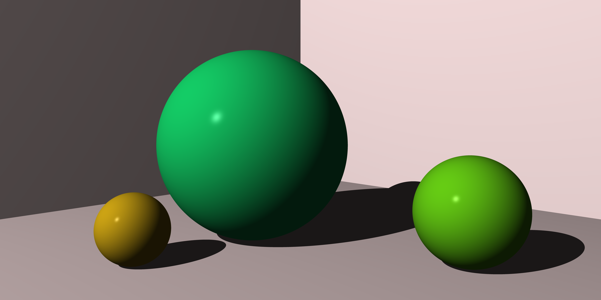

# ray-tracer

Implementation in Rust of a ray tracer following [The Ray Tracer Challenge](https://www.goodreads.com/book/show/39933047-the-ray-tracer-challenge) book.

```
The renderer is a ray tracer, which means it simulates the physics of light by tracing the path of light rays around your scene. 
Each exciting chapter presents a bite-sized piece of the puzzle, building on earlier chapters and setting the stage for later ones.
Requirements are given language-agnostically; it’s up to you to translate them into tests and code using whatever language you prefer.
When the project is complete, you’ll look back and realize you’ve built an entire system test-first!
```

## Status 

in progress chapter 9 of 17

## Example(s)

End result of chapter 8 on shadows.

`10000x5000` for fun  



## Hacking

### Performance profiling

The code can be profiled to remove bottlenecks and keep the rendering fast as features are added.

`cargo install flamegraph` to install https://github.com/flamegraph-rs/flamegraph

then inside the project directory we can profile `cargo run --release` by running `cargo flamegraph`

Latest [flamegraph](flamegraph.svg).

### Todos and ideas

[todo](todo.md)